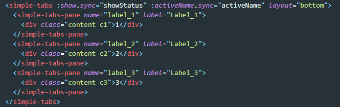
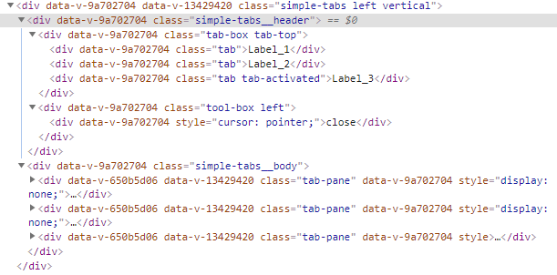
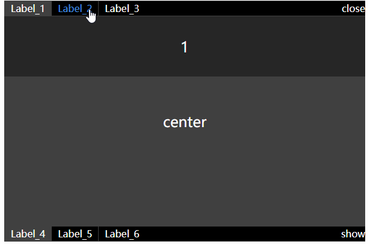
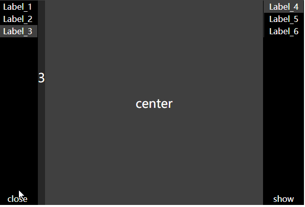

## 仿制一个tab组件

### jsx

React社区最先使用jsx，利用js的编程能力来创建虚拟DOM(虚拟DOM显著减少实际DOM操作，大幅提升应用性能)。vue中使用jsx需要先安装一个[babel插件](<https://github.com/vuejs/jsx>)。

* 基本结构

  ```jsx
  const dom = (
  	<div class={`simple-clazz`}>
  		<section>{content}</section>
  	</div>
  )
  ```

* (): 创建一个DOM结构

* <>:作为元素解析

* {}: 作为js解析

* if语句:用三元运算符实现

  ```jsx
  const dom = (
  	<div class={isAclass ? 'A' : 'B'}></div>
  )
  ```

  

* 循环

  ```jsx
  const dom = (
  	<div>
          {
              array.map((row, index) => {
                  return (
                  	<div class={row.clazz}>{index}</div>
                  )
              })
          }
      </div>
  )
  ```

  

* 事件绑定

  ```jsx
  const onDomClicked = (ev) => console.log('clicked dom', ev)
  const dom = (
  	<div on-click={onDomClicked}></div>
  )
  const dom2 = (
  	<div on-click={(ev) => {onDomClicked(ev)}}></div>
  )
  ```

  

* 样式

  ```jsx
  const dom = (
  	<div
          class={{
              classA: true,
              classB: isClassB ? true : false
          }}
          style={{
              color: '#fff',
              background: '#404040'
          }}
      ></div>
  )
  ```

  

### tab页

项目中使用了element-ui(vue)。但是有定制化的需求，索性想重写一个。于是直接去看了[源码](<https://github.com/ElemeFE/element/tree/dev/packages/tabs/src>),这里拆分一下。

```markdown
* 目录
  - tab-bar.vue 暂时不用管
  - tab-nav.vue 导航栏
  - tab-pane.vue 单个面板。对应`<el-tab-pane></el-tab-pane>`这个组件
  - tabs.vue 对应`<el-tabs></el-tabs>`这个组件
```

实际需求主要是自己项目内让组件可控，不然产品和设计随时变的话，每次去适配element会很烦。如果自己能沉淀一个tab组件出来，那就能解决大部分变态的需求了(少了很多对element样式的/deep/)。

* 我们所期待的调用方式



* 我们最后生成的结果



* 核心代码
  1. 获取内部的子组件:`this.$slots.default`。这个方法能拿到内部的所有子组件，是一个数组，当然在`jsx`内需要渲染的时候，可以直接写成`{this.$slots.default}`
  2. 获取组件的tag:`vnode.componentOptions.tag`
  3. 获取组件实例:`组件.componentInstance`
  4. 获取父组件实例: `this.$parent`
  5. 通过获取到的js值，利用vue的render函数就可以完成组件构建
* 效果示例
  
  

### 总结

1. `jsx`提供了一种利用完全js能力编写组件的方式，与`vue`本身的模板模式相辅相成。`vue`官方是推荐绝大多数情况用模板。笔者以为，当我们需要开发一个灵活多变的组件时，应该尝试`jsx`，这样在后期功能变化时，我们扩展能力也很强，在开发变化较少的业务模块时，就应该使用`template`模式，开发起来更简便快捷。
2. `jsx`的开发体验也是很棒的，值得多去尝试，尤其是在需要构建项目的基础物料的时候。
